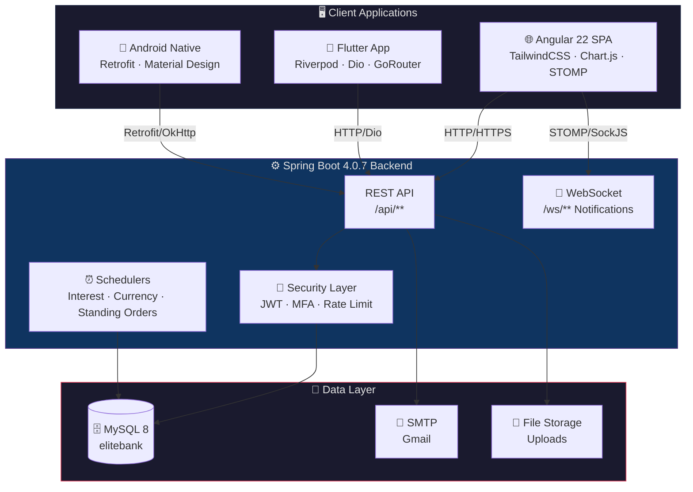
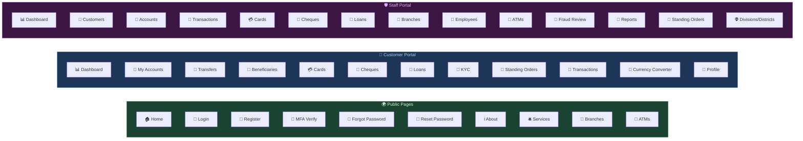
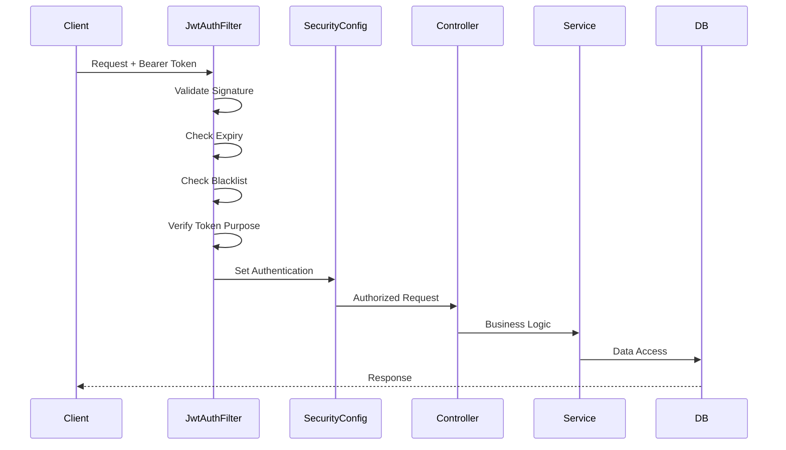

<](https://spring.io/projects/spring-boot)
[](https://angular.io/)
[](https://flutter.dev/)
[](https://developer.android.com/)
[](https://openjdk.org/)
[](https://www.mysql.com/)
[](docker-compose.yml)
[](RAILWAY_DEPLOYMENT.md)
[](LICENSE)

---

> **EnsarkBank** is a production-grade, multi-platform banking system covering **core retail & branch banking**: customer onboarding & KYC, accounts, cards, loans, transfers, beneficiaries, cheques, standing orders, ATMs, branches, HR/employee management, fraud detection, double-entry accounting/ledger, and financial reporting — all secured behind **JWT + MFA authentication**.

</div>

---

## 📑 Table of Contents

- [Repository Structure](#-repository-structure)
- [Architecture Overview](#-architecture-overview)
- [Tech Stack](#-tech-stack)
- [Feature Modules](#-feature-modules)
- [Prerequisites](#-prerequisites)
- [Getting Started](#-getting-started)
- [🐳 Docker & Railway Deployment](#-docker--railway-deployment)
- [Environment Configuration](#-environment-configuration)
- [API Reference](#-api-reference)
- [Project Status](#-project-status)
- [Useful Commands](#-useful-commands)
- [Notes & Next Steps](#-notes--next-steps)

---

## 📁 Repository Structure

```
BankManagementSystem/
│
├── 🔙 ensark/                  # Backend — Spring Boot REST API (Java 21)
│   ├── src/main/java/          # Domain modules, config, security, utils
│   ├── src/main/resources/     # application.properties, templates
│   └── pom.xml                 # Maven build (Spring Boot 4.0.7)
│
├── 🌐 ensark-frontend/         # Web Client — Angular 22 SPA (TypeScript)
│   ├── src/app/features/       # public, customer, staff feature modules
│   ├── src/app/core/           # Guards, interceptors, services, models
│   ├── src/app/shared/         # Reusable components, pipes, directives
│   └── package.json            # Angular 22.1 + TailwindCSS 4
│
├── 📱 ensark-flutter/           # Cross-Platform Mobile — Flutter (Dart)
│   ├── lib/features/           # 12 feature modules (accounts, auth, cards...)
│   ├── lib/providers/          # Riverpod state management
│   ├── lib/repositories/       # Data layer (Dio HTTP client)
│   ├── lib/models/             # Freezed data models
│   └── pubspec.yaml            # Flutter 3.10, Dart ^3.10.7
│
└── 📲 ensarkbank-android/       # Native Android — Java
    ├── app/src/main/java/      # API, models, UI, session, utils
    ├── app/src/main/res/       # Layouts, drawables, navigation
    └── build.gradle            # compileSdk 37, Java 11
```

<div align="center">

| Module | Stack | Default URL / Port | Package |
|:------:|:-----:|:------------------:|:-------:|
| `ensark` | Spring Boot 4.0.7 · Java 21 · JPA · Security | `http://localhost:8085` | `com.elitetech_inc.ensarkbank` |
| `ensark-frontend` | Angular 22.1 · TailwindCSS 4 · RxJS · Chart.js | `http://localhost:4200` | `app.*` |
| `ensark-flutter` | Flutter · Dart 3.10 · Riverpod · Dio · GoRouter | `http://localhost:8085` (API) | `ensarkbank_flutter` |
| `ensarkbank-android` | Android SDK 37 · Retrofit 2 · Material Design | Installable APK | `com.ensark.ensarkbank` |

</div>

---

## 🏗 Architecture Overview



---

## 🛠 Tech Stack

### ⚙️ Backend — `ensark`

| Category | Technology |
|:--------:|:----------:|
| **Framework** | Spring Boot 4.0.7 (WebMvc, Data JPA, Validation, Security, Mail, Thymeleaf, WebSocket) |
| **Language** | Java 21 |
| **Database** | MySQL 8 — JPA / Hibernate (`ddl-auto=update`) |
| **Auth & Security** | Spring Security · JWT (`jjwt` 0.12.7) · BCrypt · TOTP MFA (`dev.samstevens.totp`) |
| **Object Mapping** | MapStruct 1.6.3 + Lombok 1.18.34 |
| **API Docs** | springdoc-openapi → Swagger UI (`/swagger-ui.html`) |
| **PDF Generation** | OpenHTMLToPDF (statements / PDF export) |
| **Data Export** | Apache POI (Excel) + OpenCSV (CSV) |
| **QR Codes** | ZXing (barcode / QR generation) |
| **Resilience** | Spring Retry (optimistic-lock retries) · Spring AOP |
| **Real-time** | WebSocket notifications (STOMP) |

### 🌐 Frontend — `ensark-frontend`

| Category | Technology |
|:--------:|:----------:|
| **Framework** | Angular 22.1 — standalone components, lazy routing |
| **Styling** | TailwindCSS 4 · PostCSS |
| **Icons** | Lucide Angular (`@lucide/angular`) |
| **Charts** | Chart.js 4.5 |
| **HTTP & Real-time** | RxJS 7.8 · `HttpClient` · `@stomp/stompjs` + `sockjs-client` |
| **Security Utils** | `crypto-js` (client-side hashing) |
| **Export** | `jsPDF` + `jspdf-autotable` (PDF export) |
| **Testing** | Vitest 4.0 |
| **Code Quality** | Prettier · EditorConfig |
| **TypeScript** | TypeScript 6.0 |

### 📱 Flutter Mobile — `ensark-flutter`

| Category | Technology |
|:--------:|:----------:|
| **Framework** | Flutter (Dart SDK ^3.10.7) |
| **State Management** | Riverpod 2.4 + Riverpod Generator + Riverpod Annotation |
| **Data Models** | Freezed 2.4 + JSON Serializable |
| **HTTP Client** | Dio 5.4 |
| **Routing** | GoRouter 14.0 |
| **Secure Storage** | `flutter_secure_storage` 9.0 |
| **UI Extras** | Google Fonts · SpinKit (loading animations) · QR Flutter (MFA QR) |
| **Biometrics** | `local_auth` 2.2 (fingerprint / Face ID) |
| **Image Picker** | `image_picker` 1.0 |
| **Internationalization** | `intl` 0.19 |
| **Code Generation** | `build_runner` · `freezed` · `json_serializable` · `riverpod_generator` |

### 📲 Android Native — `ensarkbank-android`

| Category | Technology |
|:--------:|:----------:|
| **SDK** | minSdk 28 · targetSdk 37 · compileSdk 37 · Java 11 |
| **Networking** | Retrofit 2 + Gson converter · OkHttp (logging + auth interceptors) |
| **UI** | Material Design · Navigation Component · ViewBinding · CoordinatorLayout |
| **Image Loading** | Glide |
| **State Management** | Lifecycle ViewModel · `SessionManager` (SharedPreferences JWT store) |
| **Auth** | `AuthInterceptor` (automatic Bearer token injection) |
| **Code Generation** | Lombok (compile-only) |

---

## 📋 Feature Modules

### 🔙 Backend Domain Modules

<div align="center">

| Domain | Module | Key Capabilities |
|:------:|:------:|:----------------:|
| 🔐 | **Auth Management** | Login · MFA setup/verify/confirm/disable · Logout · Token refresh · Email verification · Forgot/reset password · Token validation · Rate-limited login · JWT blacklist |
| 👤 | **Customer Management** | Customer CRUD · KYC submission & review · Beneficiaries · Customer dashboard |
| 🏧 | **Account Management** | Accounts · Account holders · Transactions · Cards · Cheques · Credit accounts · Loans · Holds · Nominees · Cashier transactions · Interest scheduler |
| 🏪 | **ATM Management** | ATM registry · ATM transactions |
| 📊 | **Accounting System** | Journal entries · Ledger · Transactions (double-entry accounting) |
| 🏢 | **Branch Management** | Branch CRUD & info |
| 💱 | **Currency Management** | Currency rates (external API scheduler) · Conversion engine |
| 🌍 | **Common** | Address hierarchy (Division → District → Police Station) · Email · Notifications (WebSocket) · Security config · Enums · Global exception handling |
| 📈 | **Dashboard** | Aggregated dashboard data for staff & customers |
| 🚨 | **Fraud Detection** | Fraud flagging · Review & resolution workflow |
| 👥 | **HR Management** | Employee CRUD · Data seeder |
| 📰 | **Public Pages** | Public branch & location info |
| 📑 | **Report Management** | Trial balance · Ledger report · Profit & loss · Balance sheet |
| 🔄 | **Standing Orders** | Recurring standing orders (scheduler-driven) |

</div>

### 🌐 Frontend Page Structure (Angular)



### 📱 Flutter Feature Modules

| Feature | Screens | State (Riverpod) | Repository |
|:-------:|:-------:|:-----------------:|:----------:|
| 🔐 Auth | Login · Register · MFA · Forgot/Reset Password | `authProvider` | `authRepository` |
| 📊 Dashboard | Home Dashboard | `dashboardProvider` | — |
| 🏦 Accounts | Account List · Detail · Statements | `coreProviders` | `accountRepository` |
| 💸 Transfer | Fund Transfer | `transferProvider` | `transactionRepository` |
| 💳 Cards | Card List · Apply · Manage | `cardProvider` | `cardRepository` |
| 🏧 Loans | Loan List · Apply · Detail | `loanProvider` | `loanRepository` |
| 📝 Cheques | Cheque List · Apply | `chequeProvider` | `chequeRepository` |
| 🔄 Standing Orders | Standing Order List · Create | `standingOrderProvider` | `standingOrderRepository` |
| 📜 Statements | Statement Generation & View | `statementProvider` | `transactionRepository` |
| 🔔 Notifications | Notification Center | `notificationProvider` | `notificationRepository` |
| 👤 Profile | User Profile & Settings | `coreProviders` | `customerRepository` |
| 💱 Utilities | Currency Converter | `currencyProvider` | `generalRepository` |

### 📲 Android Native Screens

| Feature Area | Activities / Fragments |
|:------------:|:----------------------:|
| 🔐 Auth | Splash · Login · Register · MFA/OTP · Forgot/Reset Password |
| 📊 Dashboard | Main Dashboard |
| 🏦 Accounts | Account List · Detail · Account Opening |
| 💸 Transfers | Fund Transfer |
| 💳 Cards | Card List · Card Application |
| 🏧 Loans | Loan List · Loan Application |
| 📝 Cheques | Cheque Management |
| 👤 Profile | Profile Management |
| 📜 History | Transaction History |
| 📑 KYC | KYC Submission |
| 👥 Beneficiary | Beneficiary Management |
| 🔄 Standing Orders | Standing Order Management |
| 💱 Utilities | Currency Converter |

---

## ✅ Prerequisites

<table>
  <tr>
    <th>Requirement</th>
    <th>Version</th>
    <th>Used By</th>
  </tr>
  <tr>
    <td>☕ <b>JDK</b></td>
    <td>21+</td>
    <td>Backend</td>
  </tr>
  <tr>
    <td>📦 <b>Maven</b></td>
    <td>3.9+ (or bundled <code>mvnw</code>)</td>
    <td>Backend</td>
  </tr>
  <tr>
    <td>🗄️ <b>MySQL</b></td>
    <td>8.0+</td>
    <td>Backend — <code>localhost:3306</code>, schema <code>elitebank</code></td>
  </tr>
  <tr>
    <td>🟢 <b>Node.js</b></td>
    <td>20+ / npm 11+</td>
    <td>Angular Frontend</td>
  </tr>
  <tr>
    <td>🐦 <b>Flutter SDK</b></td>
    <td>3.10+ (Dart ^3.10.7)</td>
    <td>Flutter Mobile</td>
  </tr>
  <tr>
    <td>🤖 <b>Android SDK</b></td>
    <td>37 + Android Studio</td>
    <td>Android Native</td>
  </tr>
  <tr>
    <td>📧 <b>SMTP Credentials</b></td>
    <td>Gmail App Password (or any SMTP)</td>
    <td>Backend email features</td>
  </tr>
</table>

---

## 🚀 Getting Started

### 1️⃣ Backend — `ensark`

```bash
cd ensark

# Configure environment variables (see Environment Configuration below)
# Then start the server:
./mvnw spring-boot:run        # Linux / macOS
mvnw.cmd spring-boot:run      # Windows
```

| Endpoint | URL |
|:--------:|:---:|
| 🌐 API Base | `http://localhost:8085/api/` |
| 📖 Swagger UI | `http://localhost:8085/swagger-ui.html` |
| 📁 Static Uploads | `http://localhost:8085/uploads/**` |

---

### 2️⃣ Angular Frontend — `ensark-frontend`

```bash
cd ensark-frontend

npm install                    # Install dependencies
npm start                      # ng serve → http://localhost:4200
```

> **API Configuration**: `src/environments/environment.ts` → `apiUrl: 'http://localhost:8085/api/'`

```bash
# Production build
npm run build                  # Output → dist/
```

---

### 3️⃣ Flutter Mobile — `ensark-flutter`

```bash
cd ensark-flutter

flutter pub get                # Install dependencies
flutter pub run build_runner build --delete-conflicting-outputs  # Generate code

# Run on device/emulator
flutter run                    # Debug mode
flutter build apk              # Release APK
flutter build ios               # iOS (requires macOS)
```

> **API Configuration**: Update the base URL in `lib/core/api/` to point to your backend server.

---

### 4️⃣ Android Native — `ensarkbank-android`

```bash
cd ensarkbank-android

./gradlew assembleDebug        # Build debug APK
# OR open in Android Studio → Run
```

> **⚠️ Base URL Configuration**:
> - File: `api/ApiClient.java` → `BASE_URL`
> - **Emulator**: `http://10.0.2.2:8085/`
> - **Physical device**: Use your dev machine's LAN IP (e.g., `http://192.168.0.102:8085/`)
> - Requires `android.permission.INTERNET` and `usesCleartextTraffic="true"` (already configured in manifest)

---

## 🐳 Docker & Railway Deployment

### 1️⃣ Run Locally with Docker Compose

Run the complete stack (MySQL 8.0 + Spring Boot Backend + Angular Frontend) using a single command:

```bash
docker-compose up --build
```

- 🌐 **Frontend**: `http://localhost`
- ⚙️ **Backend REST API**: `http://localhost:8085/api/`
- 📖 **Swagger UI**: `http://localhost:8085/swagger-ui.html`
- 🗄️ **MySQL Database**: `localhost:3306`

### 2️⃣ Deploy to Railway.app

For detailed step-by-step instructions on deploying the MySQL database, Spring Boot backend, and Angular frontend to **Railway**, see the [Railway Deployment Guide](RAILWAY_DEPLOYMENT.md).

Quick setup summary:
1. **Database**: Provision MySQL in Railway console.
2. **Backend**: Deploy `ensark` service using `ensark/Dockerfile`. Set `SPRING_DATASOURCE_URL` to `${{MySQL.MYSQLURL}}`.
3. **Frontend**: Deploy `ensark-frontend` service using `ensark-frontend/Dockerfile` with Nginx handling HTML5 routing and Railway dynamic `$PORT`.

---

## ⚙️ Environment Configuration

### Backend Environment Variables

All sensitive values are read from environment variables with dev fallbacks in `application.properties`:

| Variable | Purpose | Default (Dev) |
|:--------:|:-------:|:-------------:|
| `DB_USERNAME` | MySQL username | `root` |
| `DB_PASSWORD` | MySQL password | `1234` |
| `JWT_SECRET` | JWT signing key (validated at startup) | *(must be set)* |
| `SMTP_USERNAME` | Email SMTP username | Gmail dev account |
| `SMTP_PASSWORD` | Email SMTP password | Gmail app password |
| `FRONTEND_URL` | CORS / WebSocket / email-link origin | `http://localhost:4200` |
| `UPLOAD_DIR` | File upload root directory | `D:/ensarkbank/uploads` |

### JWT Token Expiry Configuration

| Token Type | Config Key | Default Duration |
|:----------:|:----------:|:----------------:|
| 🔑 Access Token | `jwt.expiration` | 15 minutes |
| 🔄 Refresh Token | `jwt.refresh-expiration` | 15 minutes |
| 👨‍💼 Staff Token | `jwt.emp-expiration` | 8 hours |
| ✉️ Verification Token | `jwt.verification-expiration` | 1 hour |
| 🔐 Reset Token | `jwt.reset-expiration` | 15 minutes |

---

## 📡 API Reference

All endpoints are prefixed with `/api`. Public auth endpoints live under `/api/auth/**` (`permitAll`); all others require `Authorization: Bearer <token>`.

### 🔐 Authentication Endpoints

| Method | Endpoint | Description |
|:------:|:--------:|:-----------:|
| `POST` | `/api/auth/login` | Authenticate (rate-limited); may require MFA |
| `POST` | `/api/auth/verify-mfa` | Verify TOTP code and complete login |
| `POST` | `/api/auth/setup-mfa` | Begin MFA enrollment (returns secret + QR) |
| `POST` | `/api/auth/confirm-mfa` | Confirm MFA setup |
| `POST` | `/api/auth/disable-mfa` | Disable MFA |
| `POST` | `/api/auth/logout` | Invalidate token (blacklist) |
| `POST` | `/api/auth/refresh` | Exchange refresh token for new access token |
| `POST` | `/api/auth/register` | Customer self-registration (multipart + KYC docs) |
| `GET`  | `/api/auth/verify-email` | Email verification callback |
| `POST` | `/api/auth/send-verification` | Resend verification email |
| `POST` | `/api/auth/forgot-password` | Request password reset link |
| `POST` | `/api/auth/reset-password` | Reset password with token |
| `POST` | `/api/auth/validate` | Validate session token (signature/expiry/blacklist) |

### 🏦 Domain Endpoints

Other domains follow the same RESTful `/api/<domain>/...` convention:

| Domain | Base Path | Operations |
|:------:|:---------:|:----------:|
| Accounts | `/api/accounts` | CRUD · Balance · Holders · Nominees |
| Transactions | `/api/transactions` | List · Detail · Cashier transactions |
| Cards | `/api/cards` | CRUD · Apply · Activate · Block |
| Loans | `/api/loans` | CRUD · Apply · Approve · Repayment |
| Cheques | `/api/cheques` | CRUD · Apply · Process |
| Beneficiaries | `/api/beneficiaries` | CRUD |
| Standing Orders | `/api/standing-orders` | CRUD · Execute |
| Customers | `/api/customers` | CRUD · KYC · Dashboard |
| Employees | `/api/employees` | CRUD |
| Branches | `/api/branches` | CRUD |
| ATMs | `/api/atms` | CRUD · Transactions · Refill |
| Currency | `/api/currency` | Rates · Convert |
| Fraud | `/api/fraud` | Flag · Review · Resolve |
| Reports | `/api/reports` | Trial balance · Ledger · P&L · Balance sheet |
| Notifications | `/ws/**` | WebSocket (STOMP) real-time notifications |

### 🛡️ Security Architecture



**Security Features:**
- 🔒 **Stateless JWT** sessions (`JwtAuthFilter` ahead of Spring Security) with BCrypt password hashing
- 🔐 **MFA** via TOTP (Google Authenticator compatible) for sensitive accounts
- ⏱️ **Rate limiting** on login attempts (`RateLimitConfig`)
- 🌐 **CORS** restricted to `FRONTEND_URL`; CSRF disabled (stateless); security headers (HSTS, CSP, XSS, frame-deny) enforced
- ✅ **Token validation** — mirrors `JwtAuthFilter` checks: signature, expiry, blacklist, and access-token purpose

---

## 📊 Project Status

<table>
  <tr>
    <th>Module</th>
    <th>Status</th>
    <th>Details</th>
  </tr>
  <tr>
    <td>⚙️ <b>Backend</b> (<code>ensark</code>)</td>
    <td>🟢 <b>Mature</b></td>
    <td>
      All major banking domains have full controllers, services, entities, repositories, and DTOs (MapStruct mappers).<br/>
      Auth is fully featured: MFA, refresh, email verification, reset, validation, rate limiting.<br/>
      Cross-cutting infra: security, CORS, scheduling, retry, rate-limit, async, WebSocket notifications, OpenAPI docs.<br/>
      Recent: <code>POST /api/auth/validate</code> endpoint + <code>AuthService.validateToken</code>.
    </td>
  </tr>
  <tr>
    <td>🌐 <b>Frontend</b> (<code>ensark-frontend</code>)</td>
    <td>🟢 <b>Comprehensive SPA</b></td>
    <td>
      Three role areas: <b>public</b> (13 pages), <b>customer</b> (12 feature modules), <b>staff</b> (16 feature modules).<br/>
      Live notifications via WebSocket, charts via Chart.js, PDF/CSV export, lazy routing.<br/>
      40+ screens fully implemented with role-based access control.
    </td>
  </tr>
  <tr>
    <td>📱 <b>Flutter</b> (<code>ensark-flutter</code>)</td>
    <td>🟡 <b>Active Development</b></td>
    <td>
      12 feature modules with Riverpod state management and Freezed data models.<br/>
      12 repositories covering all backend APIs.<br/>
      Biometric auth support, secure storage, QR code generation for MFA.<br/>
      Full code generation pipeline (build_runner + freezed + riverpod_generator).
    </td>
  </tr>
  <tr>
    <td>📲 <b>Android</b> (<code>ensarkbank-android</code>)</td>
    <td>🟡 <b>Feature-Complete Skeleton</b></td>
    <td>
      Activities for: splash, login, register, MFA/OTP, forgot/reset password, dashboard, accounts, transfer, cards, loans, profile, history, KYC, beneficiary, standing orders, cheques, currency converter.<br/>
      Retrofit API services in sync with backend.<br/>
      Latest: <code>AuthApiService.validateToken(...)</code> mirroring backend validate endpoint.
    </td>
  </tr>
</table>

### Cross-Cutting Notes
- 📝 Git history is early-stage: `Initial commit` → `add frontend` → `added backend` → `android`. Recommend: adopt conventional commits and per-feature branches
- 🔗 Each client targets `localhost:8085` (web) / LAN IP (Android) / configurable (Flutter). Align via environment/config for shared deployments

---

## 💻 Useful Commands

### ⚙️ Backend

```bash
cd ensark && ./mvnw test                  # Run unit/integration tests
cd ensark && ./mvnw package               # Build runnable JAR
cd ensark && ./mvnw spring-boot:run       # Start dev server
```

### 🌐 Frontend

```bash
cd ensark-frontend && npm install         # Install dependencies
cd ensark-frontend && npm start           # Dev server (localhost:4200)
cd ensark-frontend && npm test            # Run Vitest
cd ensark-frontend && npm run build       # Production build
```

### 📱 Flutter

```bash
cd ensark-flutter && flutter pub get      # Install dependencies
cd ensark-flutter && flutter pub run build_runner build --delete-conflicting-outputs  # Generate code
cd ensark-flutter && flutter run          # Run on device/emulator
cd ensark-flutter && flutter build apk    # Build release APK
cd ensark-flutter && flutter test         # Run tests
```

### 📲 Android

```bash
cd ensarkbank-android && ./gradlew lint            # Static analysis
cd ensarkbank-android && ./gradlew assembleDebug   # Debug APK
cd ensarkbank-android && ./gradlew assembleRelease # Release APK
```

---

## 📝 Notes & Next Steps

<table>
  <tr><th>Priority</th><th>Task</th><th>Module</th></tr>
  <tr>
    <td>🔴 High</td>
    <td>Externalize Android <code>BASE_URL</code> via <code>BuildConfig</code> / <code>local.properties</code></td>
    <td>Android</td>
  </tr>
  <tr>
    <td>🔴 High</td>
    <td>Remove hardcoded secrets (<code>JWT_SECRET</code>, SMTP password) from <code>application.properties</code></td>
    <td>Backend</td>
  </tr>
  <tr>
    <td>🟡 Medium</td>
    <td>Add integration tests (Retrofit + MockWebServer) for Android</td>
    <td>Android</td>
  </tr>
  <tr>
    <td>🟡 Medium</td>
    <td>Centralize API contract via shared OpenAPI spec for all clients</td>
    <td>All</td>
  </tr>
  <tr>
    <td>🟡 Medium</td>
    <td>Enable R8/ProGuard optimization for release builds</td>
    <td>Android</td>
  </tr>
  <tr>
    <td>🟡 Medium</td>
    <td>Verify all Android activity screen bindings before release</td>
    <td>Android</td>
  </tr>
  <tr>
    <td>🟢 Low</td>
    <td>Implement CI/CD pipeline (build/lint/test) for all four modules</td>
    <td>All</td>
  </tr>
  <tr>
    <td>🟢 Low</td>
    <td>Adopt conventional commits and per-feature branching strategy</td>
    <td>All</td>
  </tr>
  <tr>
    <td>🟢 Low</td>
    <td>Add Flutter widget tests and integration tests</td>
    <td>Flutter</td>
  </tr>
</table>

---

<div align="center">

**Built with ❤️ by EliteTech Inc.**

[](https://openjdk.org/)
[](https://angular.io/)
[](https://flutter.dev/)
[](https://developer.android.com/)
[](https://www.mysql.com/)

</div>
]]>
