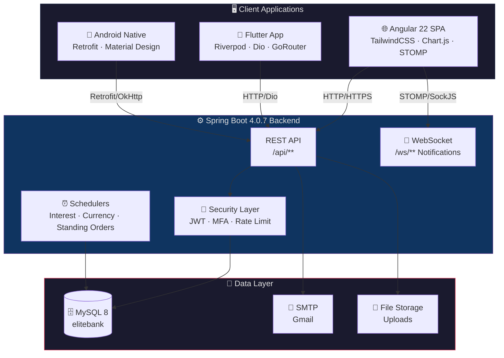

<div align="center">

# 🏦 EnsarkBank
### Enterprise Bank Management System

A Full-Stack, Multi-Channel Banking Platform providing Core Retail & Branch Banking across Web, Mobile (Cross-Platform), and Native Android.

[](https://spring.io/projects/spring-boot)
[](https://angular.io/)
[](https://flutter.dev/)
[](https://developer.android.com/)
[](https://openjdk.org/)
[](https://www.mysql.com/)
[](docker-compose.yml)

> **EnsarkBank** is a production-grade banking system covering customer onboarding, KYC, accounts, cards, loans, transfers, beneficiaries, cheques, standing orders, ATMs, branch management, HR, fraud detection, double-entry accounting, and real-time notifications — secured by **JWT & MFA authentication**.

</div>

<br/>

## 📑 Table of Contents
- [✨ Key Features](#-key-features)
- [🏗️ System Architecture](#️-system-architecture)
- [💻 Tech Stack](#-tech-stack)
- [📂 Repository Structure](#-repository-structure)
- [🚀 Getting Started](#-getting-started)
- [🐳 Deployment](#-deployment)
- [⚙️ Configuration & API](#️-configuration--api)
- [📊 Project Status](#-project-status)

---

## ✨ Key Features

- **Omnichannel Banking:** Accessible via Web (Angular), Cross-Platform Mobile (Flutter), and Native Android.
- **Robust Security:** Stateless JWT sessions, TOTP MFA, Role-Based Access Control, and Rate Limiting.
- **Comprehensive Core Banking:** Double-entry ledger accounting, interest scheduling, and currency conversion.
- **Real-Time Operations:** WebSocket (STOMP) notifications and dynamic dashboard charting.
- **Workflow Automation:** KYC review pipelines, automated fraud detection, and standing order execution.

---

## 🏗️ System Architecture



---

## 💻 Tech Stack

<details>
<summary><b>⚙️ Backend (ensark)</b></summary>

- **Core:** Spring Boot 4.0.7, Java 21
- **Database:** MySQL 8, Spring Data JPA / Hibernate
- **Security:** Spring Security, JWT (jjwt 0.12.7), BCrypt, TOTP MFA
- **Utilities:** MapStruct 1.6.3, Lombok 1.18.34, OpenHTMLToPDF, Apache POI
- **API Docs:** springdoc-openapi (Swagger UI)
</details>

<details>
<summary><b>🌐 Frontend (ensark-frontend)</b></summary>

- **Core:** Angular 22.1 (Standalone Components), TypeScript 6.0
- **Styling:** TailwindCSS 4, PostCSS
- **Libraries:** Lucide Angular, Chart.js 4.5, RxJS 7.8, @stomp/stompjs
- **Testing:** Vitest 4.0
</details>

<details>
<summary><b>📱 Flutter Mobile (ensark-flutter)</b></summary>

- **Core:** Flutter 3.10, Dart ^3.10.7
- **Architecture:** Riverpod 2.4, Freezed 2.4, GoRouter 14.0
- **Networking:** Dio 5.4
- **Security/Storage:** flutter_secure_storage 9.0, local_auth 2.2
</details>

<details>
<summary><b>📲 Android Native (ensarkbank-android)</b></summary>

- **Core:** Java 11, Android SDK 37
- **Networking:** Retrofit 2, OkHttp
- **UI:** Material Design, Navigation Component, ViewBinding
</details>

---

## 📂 Repository Structure

```text
BankManagementSystem/
├── 🔙 ensark/                  # Spring Boot REST API (Port: 8085)
├── 🌐 ensark-frontend/         # Angular SPA Web Client (Port: 4200)
├── 📱 ensark-flutter/          # Flutter Cross-Platform Mobile App
├── 📲 ensarkbank-android/      # Native Android App
├── docker-compose.yml          # Local container orchestration
└── RAILWAY_DEPLOYMENT.md       # Deployment instructions
```

---

## 🚀 Getting Started

### Prerequisites
- **Java 21+** & **Maven 3.9+**
- **Node.js 20+** (npm 11+)
- **Flutter SDK 3.10+**
- **Android SDK 37** & Android Studio
- **MySQL 8.0+** (`localhost:3306`, schema `elitebank`)

### 1️⃣ Backend Setup (`ensark`)
```bash
cd ensark
./mvnw spring-boot:run
```
*API Base URL:* `http://localhost:8085/api/` | *Swagger UI:* `http://localhost:8085/swagger-ui.html`

### 2️⃣ Frontend Setup (`ensark-frontend`)
```bash
cd ensark-frontend
npm install
npm start
```
*Web Portal:* `http://localhost:4200`

### 3️⃣ Flutter Mobile (`ensark-flutter`)
```bash
cd ensark-flutter
flutter pub get
flutter pub run build_runner build --delete-conflicting-outputs
flutter run
```

### 4️⃣ Android Native (`ensarkbank-android`)
```bash
cd ensarkbank-android
./gradlew assembleDebug
```
*Note:* Adjust `BASE_URL` in `ApiClient.java` if deploying on a physical device.

---

## 🐳 Deployment

### Local Docker Deployment
Run the complete stack (MySQL + Backend + Frontend) instantly:
```bash
docker-compose up --build
```
- **Frontend:** `http://localhost`
- **Backend:** `http://localhost:8085/api/`

### Railway Deployment
EnsarkBank is ready for cloud deployment on Railway.app. See the [Railway Deployment Guide](RAILWAY_DEPLOYMENT.md) for step-by-step instructions.

---

## ⚙️ Configuration & API

### Environment Variables (Backend)
Configure these in `application.properties` or system environment variables:

| Variable | Description | Default |
|:---|:---|:---|
| `DB_USERNAME` / `DB_PASSWORD` | MySQL credentials | `root` / `1234` |
| `JWT_SECRET` | Secret key for JWT signing | *(Requires manual setup)* |
| `SMTP_USERNAME` / `SMTP_PASSWORD` | SMTP configuration for emails | *Dev defaults* |
| `FRONTEND_URL` | Allowed CORS origins | `http://localhost:4200` |
| `UPLOAD_DIR` | File storage path | `D:/ensarkbank/uploads` |

### API Security Flow
1. **Login:** `POST /api/auth/login` (Triggers MFA if configured)
2. **Access:** Include `Authorization: Bearer <token>` in requests.
3. **Validation:** Stateless verification checks signature, expiry, and purpose via `JwtAuthFilter`.

<details>
<summary><b>View Module Endpoints Summary</b></summary>

- `/api/auth/**`: Login, MFA, Password Reset, JWT Validation
- `/api/accounts/**`: Balance, Holders, Transactions
- `/api/cards/**` & `/api/loans/**`: Application and Management
- `/api/fraud/**`: Detection and Review workflows
- `/ws/**`: STOMP WebSocket Notifications
</details>

---

## 📊 Project Status

| Module | Status | Highlights |
|:---|:---:|:---|
| **Backend** (`ensark`) | 🟢 Mature | Complete domain modules, MFA, rate-limiting, and WebSocket integration. |
| **Frontend** (`ensark-frontend`) | 🟢 Mature | 40+ responsive screens across Public, Customer, and Staff portals. |
| **Flutter** (`ensark-flutter`) | 🟡 Active | 12 feature modules powered by Riverpod and Freezed. |
| **Android** (`ensarkbank-android`) | 🟡 Stable | Complete UI skeleton and Retrofit integrations in sync with the backend. |

### 🛠️ Useful Commands
<details>
<summary><b>Show developer commands</b></summary>

**Backend:**
`./mvnw test` | `./mvnw package`

**Frontend:**
`npm test` | `npm run build`

**Flutter:**
`flutter build apk` | `flutter test`

**Android:**
`./gradlew lint` | `./gradlew assembleRelease`
</details>

---

<div align="center">
<b>Built with ❤️ by EliteTech Inc.</b><br><br>

[](https://openjdk.org/)
[](https://angular.io/)
[](https://flutter.dev/)
[](https://developer.android.com/)
[](https://www.mysql.com/)

</div>
